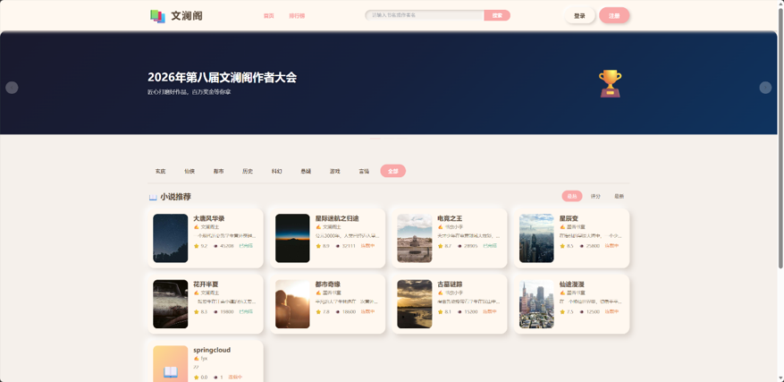
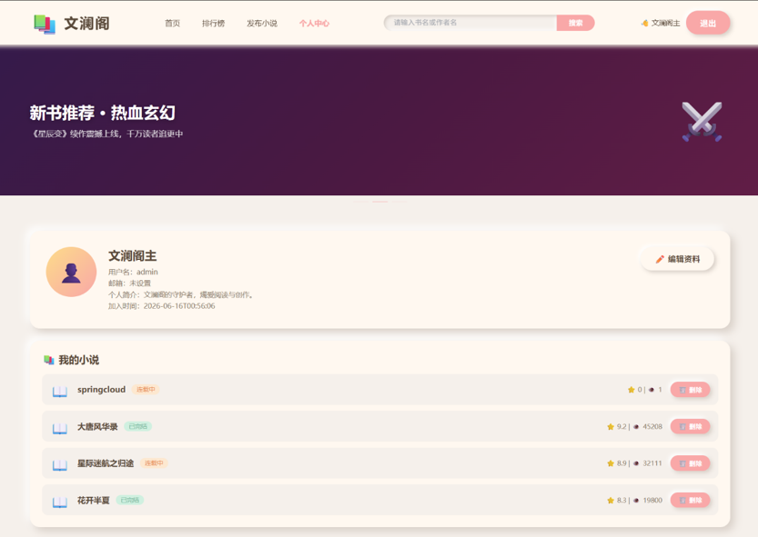
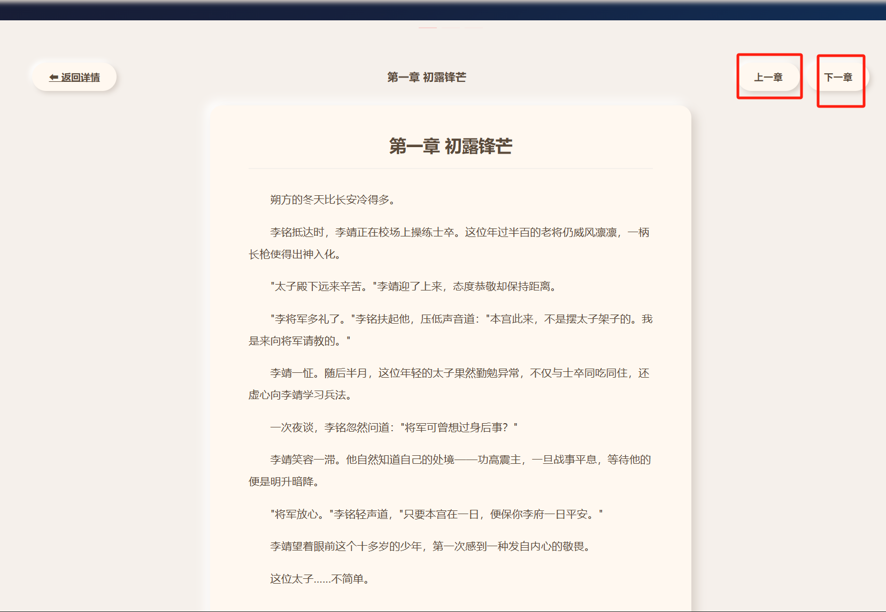
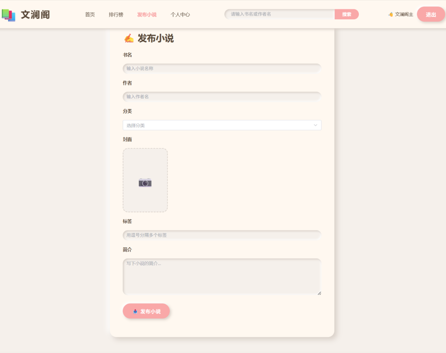
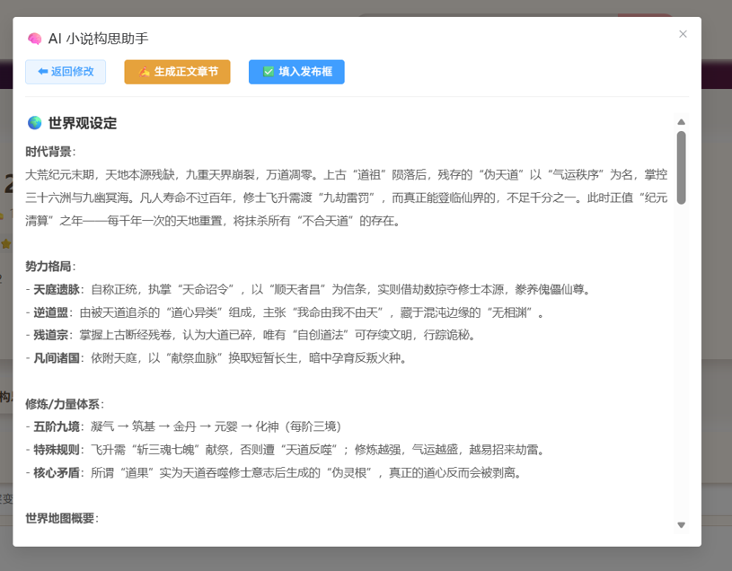
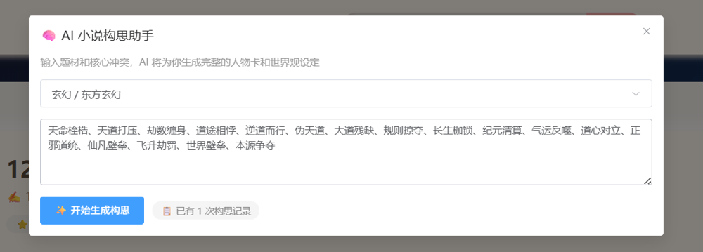
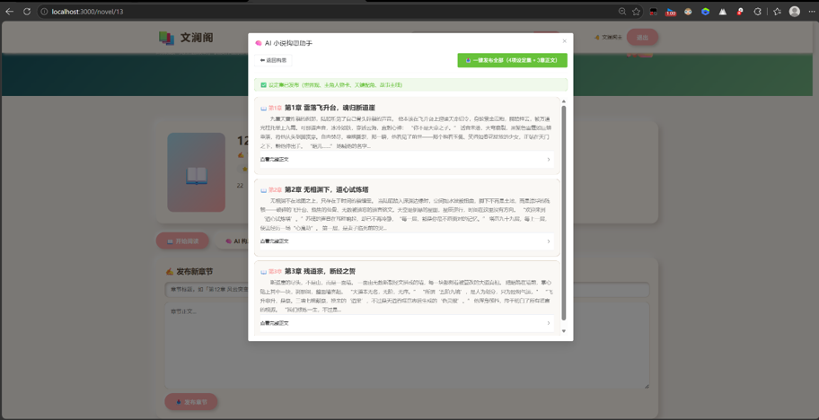

<p align="center">
  
  
  
  
  
  
  
</p>

<h1 align="center">📚 文澜阁 · Novel Platform</h1>

<p align="center">
  <strong>Vue 3 + Spring Cloud 微服务架构 · AI 赋能的小说阅读与创作平台</strong>
</p>

<p align="center">
  <a href="#-功能亮点">功能亮点</a> ·
  <a href="#-技术栈">技术栈</a> ·
  <a href="#-系统架构">系统架构</a> ·
  <a href="#-快速开始">快速开始</a> ·
  <a href="#-API-文档">API 文档</a> ·
  <a href="#-项目结构">项目结构</a> ·
  <a href="#-界面预览">界面预览</a>
</p>

---

## ✨ 功能亮点

<table>
  <tr>
    <td width="50%">
      <h3>🤖 AI 创作助手</h3>
      <ul>
        <li>🎯 <b>智能构思</b>：输入题材+冲突，AI 自动生成世界观、人物卡、配角、故事主线</li>
        <li>✍️ <b>多章节生成</b>：一键将构思展开为 3-5 个连续章节，剧情自动连贯</li>
        <li>📜 <b>历史对话</b>：记录历次构思，后续生成时自动参考历史保持设定一致</li>
        <li>📝 <b>正文续写</b>：基于已有内容智能续写，保持文风和人设</li>
        <li>📤 <b>一键发布</b>：设定集 + 多章正文一键发布到章节列表</li>
        <li>Powered by <b>阿里云通义千问 (Qwen)</b></li>
      </ul>
    </td>
    <td width="50%">
      <h3>📖 阅读体验</h3>
      <ul>
        <li>🏠 <b>首页推荐</b>：网格展示 + 分类筛选 + 关键词搜索 + 多维度排序</li>
        <li>📑 <b>沉浸阅读</b>：上下章平滑导航，字数统计，阅读进度</li>
        <li>❤️ <b>粘土可爱风 UI</b>：暖色调 + 新拟物阴影 + 大圆角 + 胶囊按钮</li>
      </ul>
      <h3>🔐 平台功能</h3>
      <ul>
        <li>👤 JWT 无状态认证 + Token 自动刷新</li>
        <li>✏️ 作者专属：发布/编辑/删除小说与章节</li>
        <li>📊 点击量/收藏/评分/字数多维度统计</li>
        <li>🎨 轮播广告横幅 + 响应式布局</li>
      </ul>
    </td>
  </tr>
</table>

---

## 🛠 技术栈

| 层级 | 技术 | 版本 |
|------|------|------|
| **前端框架** | Vue 3 + Composition API | 3.4 |
| **UI 组件库** | Element Plus | 2.5 |
| **状态管理** | Pinia | 2.1 |
| **路由** | Vue Router | 4.2 |
| **HTTP 客户端** | Axios | 1.6 |
| **CSS 预处理** | SCSS (Sass) | 1.69 |
| **后端框架** | Spring Boot | 2.7.18 |
| **微服务治理** | Spring Cloud Alibaba | 2021.0.6.0 |
| **服务注册** | Nacos | 2.x |
| **API 网关** | Spring Cloud Gateway | 2021.0.9 |
| **远程调用** | OpenFeign | — |
| **ORM** | MyBatis-Plus | 3.5.5 |
| **数据库** | MySQL | 8.0 |
| **缓存** | Redis | — |
| **认证** | JWT (jjwt) | 0.9.1 |
| **AI 模型** | 通义千问 Qwen (DashScope SDK) | 2.16.7 |
| **语言** | Java 21 | — |
| **构建工具** | Maven | 3.9+ |

---

## 🏗 系统架构

```
┌─────────────────────────────────────────────────────────────────┐
│                     🖥️  Browser (localhost:3000)                  │
│                  Vue 3 · Element Plus · Pinia · Axios            │
└──────────────────────────────┬──────────────────────────────────┘
                               │  HTTP REST /api/**
                               ▼
┌─────────────────────────────────────────────────────────────────┐
│              🌐 API Gateway (Spring Cloud Gateway :8080)          │
│              路由转发 · 跨域处理 · 请求限流 · 鉴权过滤             │
└───────┬──────────┬──────────┬──────────┬──────────┬─────────────┘
        │          │          │          │          │
        ▼          ▼          ▼          ▼          ▼
┌──────────┐┌──────────┐┌──────────┐┌──────────┐┌──────────┐
│  User    ││  Novel   ││ Chapter  ││   AI     ││Discovery │
│ Service  ││ Service  ││ Service  ││ Service  ││ Service  │
│  :8081   ││  :8082   ││  :8083   ││  :8084   ││  :8761   │
│          ││          ││          ││          ││          │
│ 注册/登录││ 小说CRUD ││ 章节管理 ││ AI 构思  ││ 服务注册 │
│ 用户管理 ││ 分类搜索 ││ 内容存储 ││ 续写生成 ││ 健康检查 │
└────┬─────┘└────┬─────┘└────┬─────┘└──────────┘└──────────┘
     │           │           │
     └───────────┼───────────┘
                 │  OpenFeign
                 ▼
     ┌───────────────────────┐
     │  ☁️ Alibaba Cloud      │
     │    DashScope (Qwen)   │
     └───────────────────────┘
         AI 模型推理

     ┌──────────┐  ┌──────────┐  ┌──────────────┐
     │  MySQL   │  │  Redis   │  │    Nacos     │
     │  :3306   │  │  :6379   │  │   :18848     │
     │ 数据存储 │  │  缓存    │  │ 服务注册发现  │
     └──────────┘  └──────────┘  └──────────────┘
```

### 微服务职责

| 模块 | 端口 | 职责 | 数据库 |
|------|------|------|--------|
| `gateway` | 8080 | 统一入口、路由转发、CORS 跨域 | ❌ |
| `user-service` | 8081 | 登录注册、用户信息管理、Token 鉴权 | ✅ |
| `novel-service` | 8082 | 小说 CRUD、分类管理、搜索排序、点击统计 | ✅ |
| `chapter-service` | 8083 | 章节 CRUD、内容存储、字数统计 | ✅ |
| `ai-service` | 8084 | AI 构思、续写、多章节生成 | ❌ |
| `common` | — | 统一返回封装、JWT 工具、全局异常处理 | ❌ |
| `discovery` | 8761 | 服务注册中心 (Eureka) | ❌ |

---

## 🚀 快速开始

### 环境要求

| 软件 | 版本 | 说明 |
|------|------|------|
| JDK | 21+ | 后端运行环境 |
| Maven | 3.9+ | 后端构建 |
| MySQL | 8.0 | 主数据库 |
| Redis | 6.x+ | 缓存（可选，user-service 使用） |
| Node.js | 16+ | 前端运行环境 |
| Nacos | 2.x | 服务注册中心 |

### 1️⃣ 克隆项目

```bash
git clone https://github.com/Seredipited/novel-platform.git
cd novel-platform
```

### 2️⃣ 初始化数据库

```bash
# 创建数据库并导入种子数据
mysql -u root -p < sql/init.sql

# 导入 Nacos 配置数据库（如需使用 MySQL 存储的 Nacos）
mysql -u root -p < sql/nacos-init.sql
```

> 测试账号：`admin` / `123456`（管理员）、`author_wang` / `123456`（作者）

### 3️⃣ 启动 Nacos

```bash
# Windows (Docker 方式)
sql/start-nacos.bat

# 或自行启动 Nacos
# 默认控制台：http://localhost:18848/nacos
# 用户名/密码：nacos/nacos
```

### 4️⃣ 配置 AI API Key

> ⚠️ **重要**：使用 AI 功能前必须配置通义千问 API Key

编辑 `backend/ai-service/src/main/resources/application.yml`：

```yaml
ai:
  dashscope:
    api-key: sk-your-api-key-here    # 替换为你的 DashScope API Key
    model: qwen-flash                # 或 qwen-plus / qwen-max
```

> 前往 [阿里云 DashScope 控制台](https://dashscope.console.aliyun.com/) 获取 API Key

### 5️⃣ 启动后端服务

在 IDEA 中按顺序启动（或使用 Maven）：

```bash
cd backend

# 1. Discovery 服务
# 2. Gateway 网关
# 3. User Service (8081)
# 4. Novel Service (8082)
# 5. Chapter Service (8083)
# 6. AI Service (8084)
```

> 确保各服务在 Nacos 控制台 `服务管理 → 服务列表` 中显示为"健康"状态

### 6️⃣ 启动前端

```bash
cd frontend
npm install
npm run serve
```

### 7️⃣ 访问应用

- 🌐 **前端页面**：[http://localhost:3000](http://localhost:3000)
- 🔧 **Nacos 控制台**：[http://localhost:18848/nacos](http://localhost:18848/nacos)
- 🌉 **API 网关**：[http://localhost:8080](http://localhost:8080)

---

## 📡 API 文档

> 所有接口通过 Gateway (8080) 统一入口，路径前缀 `/api`

### 用户模块 (`/api/user`)

| 方法 | 路径 | 说明 | 鉴权 |
|------|------|------|:----:|
| POST | `/api/user/login` | 用户登录，返回 JWT Token | ✗ |
| POST | `/api/user/register` | 用户注册 | ✗ |
| GET | `/api/user/profile` | 获取当前用户信息 | ✓ |
| PUT | `/api/user/profile` | 更新个人资料 | ✓ |

### 小说模块 (`/api/novel`)

| 方法 | 路径 | 说明 | 鉴权 |
|------|------|------|:----:|
| GET | `/api/novel/list` | 小说列表（分页+筛选+排序） | ✗ |
| GET | `/api/novel/categories` | 分类列表 | ✗ |
| GET | `/api/novel/detail/{id}` | 小说详情（含点击量+1） | ✗ |
| POST | `/api/novel/publish` | 发布新小说 | ✓ |
| GET | `/api/novel/my` | 我的小说列表 | ✓ |
| DELETE | `/api/novel/{id}` | 删除小说 | ✓ |

### 章节模块 (`/api/chapter`)

| 方法 | 路径 | 说明 | 鉴权 |
|------|------|------|:----:|
| GET | `/api/chapter/list/{novelId}` | 章节列表 | ✗ |
| GET | `/api/chapter/detail/{id}` | 章节内容 | ✗ |
| POST | `/api/chapter/add` | 新增章节 | ✓ |
| PUT | `/api/chapter/update` | 更新章节 | ✓ |
| DELETE | `/api/chapter/delete/{id}` | 删除章节 | ✓ |

### AI 模块 (`/api/ai`) 🔥

| 方法 | 路径 | 说明 | 鉴权 |
|------|------|------|:----:|
| POST | `/api/ai/brainstorm` | AI 构思（题材+冲突 → 世界观+人物卡+故事线） | ✗ |
| POST | `/api/ai/continue` | AI 续写（前文 → 续写段落） | ✗ |
| POST | `/api/ai/generate-chapter` | 构思转单章（Markdown → 纯文本小说） | ✗ |
| POST | `/api/ai/generate-chapters` | 构思转多章（含历史上下文，3章连贯输出） | ✗ |

<details>
<summary><b>📋 响应格式</b></summary>

所有接口统一返回：

```json
{
  "code": 200,
  "message": "success",
  "data": { ... }
}
```

AI 构思返回示例：

```json
{
  "code": 200,
  "data": {
    "raw": "## 一、世界观设定\n...",
    "parsed": {
      "worldSetting": "时代背景...",
      "mainCharacter": "主角信息...",
      "supportingCast": "配角信息...",
      "storyOutline": "故事主线..."
    }
  }
}
```

AI 多章节生成返回示例：

```json
{
  "code": 200,
  "data": {
    "chapters": [
      { "title": "第1章 重生之始", "content": "夜幕降临..." },
      { "title": "第2章 暗流涌动", "content": "翌日清晨..." },
      { "title": "第3章 绝处逢生", "content": "狂风呼啸..." }
    ]
  }
}
```

</details>

### 鉴权说明

除登录/注册外，需鉴权的接口在请求头中携带 Token：

```
Authorization: Bearer <jwt_token>
```

---

## 📁 项目结构

```
novel-platform/
│
├── 📄 README.md
│
├── 📁 backend/                         # 后端微服务 (Spring Cloud)
│   ├── pom.xml                         # 父 POM (Maven 多模块)
│   ├── common/                         # 公共模块
│   │   └── src/main/java/com/novel/common/
│   │       ├── result/                 # Result / PageResult 统一返回
│   │       ├── exception/              # BusinessException / GlobalExceptionHandler
│   │       ├── util/                   # JwtUtil / MybatisMetaObjectHandler
│   │       └── config/                 # 公共配置
│   ├── discovery/                      # 服务注册中心 (Eureka :8761)
│   ├── gateway/                        # API 网关 (Spring Cloud Gateway :8080)
│   │   └── src/main/resources/
│   │       └── application.yml         # 路由配置 (4条路由规则)
│   ├── user-service/                   # 用户服务 (:8081)
│   │   └── src/main/java/com/novel/user/
│   │       ├── controller/UserController.java
│   │       ├── service/UserService.java
│   │       ├── mapper/UserMapper.java
│   │       └── entity/User.java
│   ├── novel-service/                  # 小说服务 (:8082)
│   │   └── src/main/java/com/novel/novel/
│   │       ├── controller/NovelController.java
│   │       ├── service/NovelService.java
│   │       ├── mapper/NovelMapper.java
│   │       └── entity/Novel.java
│   ├── chapter-service/                # 章节服务 (:8083)
│   │   └── src/main/java/com/novel/chapter/
│   │       ├── controller/ChapterController.java
│   │       ├── service/ChapterService.java
│   │       ├── mapper/ChapterMapper.java
│   │       └── entity/Chapter.java
│   └── ai-service/                     # AI 服务 (:8084) 🔥
│       └── src/main/java/com/novel/ai/
│           ├── controller/AiController.java
│           ├── service/AiService.java
│           └── service/impl/AiServiceImpl.java  # 4 个 Prompt 工程
│
├── 📁 frontend/                        # 前端 (Vue 3 + Element Plus)
│   ├── package.json
│   ├── vue.config.js                   # 开发服务器 :3000, 代理 /api -> :8080
│   └── src/
│       ├── main.js                     # 入口：挂载 ElementPlus + Router + Pinia
│       ├── App.vue                     # 根组件 (Header + Banner + RouterView + Footer)
│       ├── views/                      # 页面组件 (7 个)
│       │   ├── Home.vue               # 首页：轮播Banner + 分类筛选 + 小说网格
│       │   ├── Login.vue              # 登录页
│       │   ├── Register.vue           # 注册页
│       │   ├── NovelDetail.vue        # 小说详情：信息 + AI构思入口 + 章节管理
│       │   ├── ChapterRead.vue        # 章节阅读：沉浸式 + 上下章导航
│       │   ├── NovelPublish.vue       # 发布小说表单
│       │   └── UserCenter.vue         # 用户中心：资料编辑 + 我的小说
│       ├── components/                 # 公共组件 (5 个)
│       │   ├── AppHeader.vue          # 顶部导航栏 (Logo + 搜索 + 用户菜单)
│       │   ├── AppFooter.vue          # 页脚
│       │   ├── AdBanner.vue           # 轮播广告横幅
│       │   ├── NovelCard.vue          # 小说卡片 (图片 + 标题 + 标签)
│       │   └── AiBrainstorm.vue       # AI 构思弹窗 (3步式交互) 🔥
│       ├── api/                        # API 接口封装 (4 个)
│       │   ├── user.js                # 用户 API
│       │   ├── novel.js               # 小说 API
│       │   ├── chapter.js             # 章节 API
│       │   └── ai.js                  # AI API (120s 超时)
│       ├── router/index.js            # 路由配置 (7 条路由)
│       ├── store/index.js             # Pinia 状态管理 (userStore)
│       ├── utils/request.js           # Axios 封装 (baseURL /api, JWT 拦截器)
│       └── assets/
│           └── styles/global.scss     # 粘土可爱风全局样式变量
│
├── 📁 sql/                             # 数据库脚本
│   ├── init.sql                        # 核心数据库初始化 (4 张表 + 种子数据)
│   ├── nacos-init.sql                  # Nacos 配置数据库
│   └── start-nacos.bat                 # Nacos Docker 启动脚本
│
└── 📁 docs/
    └── images/                         # 截图等文档资源
```

---

## 🎨 界面预览

<p align="center">
  
</p>
<p align="center"><b>🏠 首页</b> — 轮播 Banner、分类筛选、小说网格推荐与多维度排序</p>

<br>

<p align="center">
  
</p>
<p align="center"><b>👤 个人中心</b> — 资料编辑、我的作品列表与创作数据概览</p>

<br>

<p align="center">
  
</p>
<p align="center"><b>📖 沉浸式章节阅读</b> — 清爽排版、上下章快捷导航、字数统计</p>

<br>

<p align="center">
  
</p>
<p align="center"><b>✍️ 发布小说</b> — 书名、分类、封面、标签与简介一站式创作入口</p>

<br>

<p align="center">
  
  &nbsp;
  
</p>
<p align="center"><b>🤖 AI 小说构思助手</b> — 选择题材 + 输入核心冲突，自动生成世界观、人物卡与故事主线</p>

<br>

<p align="center">
  
</p>
<p align="center"><b>✨ AI 正文续写 / 多章生成</b> — 基于构思上下文一键生成 3 章连贯正文，并支持一键发布</p>

---

## 🤖 AI 创作流程图

```
用户输入 ──────────────────────────────────────────────────────────────►
                                                                        │
  ① 选择题材 + 输入冲突                                                  │
         │                                                               │
         ▼                                                               │
  ② AI 生成构思（通义千问 Qwen）                                        │
     ├── 🌍 世界观设定 (150字+)                                          │
     ├── 👤 主角人物卡 (姓名/性格/背景/能力)                              │
     ├── 👥 关键配角 (2-3个)                                             │
     └── 📖 故事主线 (三幕式结构)                                        │
         │                                                               │
         │  记录到历史对话 ────────────────────────────► 下次生成时      │
         │                                             自动参考历史       │
         ▼                                                              │
  ③ 点击"生成正文章节"                                                   │
     ├── 自动附带历史构思上下文 → 确保设定一致                           │
     ├── AI 生成 3 个连贯章节（每个 600-1200 字）                        │
     └── 卡片预览，可展开查看每章完整正文                                 │
         │                                                               │
         ▼                                                               │
  ④ 一键发布全部                                                         │
     ├── 4 项设定集作为章节发布（世界观 + 主角 + 配角 + 主线）            │
     └── 3 章正文同时发布到章节列表                                      │
```

---

## 🔧 开发指南

### 后端开发

```bash
# 编译全部模块
cd backend
mvn clean install -DskipTests

# 编译单个模块
mvn -pl ai-service -am compile
```

### 前端开发

```bash
cd frontend
npm run serve      # 开发模式 (hot-reload)
npm run build      # 生产构建
```

### 添加新的 AI 功能

1. 在 `AiService.java` 中定义接口方法
2. 在 `AiServiceImpl.java` 中实现 + 编写 System Prompt
3. 在 `AiController.java` 中添加 REST 端点
4. 在 `frontend/src/api/ai.js` 中封装前端 API

### 添加新的微服务

1. 在 `backend/` 下创建 Maven 模块
2. 在父 POM 的 `<modules>` 中注册
3. 配置 `application.yml`（服务名 + 端口 + Nacos）
4. 在 Gateway 的 `application.yml` 中添加路由规则

---

## 📊 数据库 ER 图

```
┌─────────────────┐       ┌──────────────────┐
│   novel_user    │       │  novel_category   │
├─────────────────┤       ├──────────────────┤
│ id        (PK)  │       │ id         (PK)   │
│ username        │       │ name              │
│ password        │       │ description       │
│ nickname        │       └──────────────────┘
│ email           │               ▲
│ avatar          │               │
│ gender          │     ┌─────────┴─────────┐
│ deleted         │     │      novel        │
│ create_time     │     ├───────────────────┤
│ update_time     │     │ id        (PK)    │
└─────────────────┘     │ title             │
                        │ author            │
                        │ author_id  (FK)   │
                        │ category_id (FK)  │
                        │ status            │
                        │ score             │
                        │ word_count        │
                        │ click_count       │
                        │ favorite_count    │
                        │ description       │
                        │ cover_img         │
                        │ tags              │
                        │ deleted           │
                        └────────┬──────────┘
                                 │ 1:N
                                 ▼
                    ┌────────────────────────┐
                    │     novel_chapter       │
                    ├────────────────────────┤
                    │ id             (PK)    │
                    │ novel_id        (FK)   │
                    │ title                  │
                    │ content   (MEDIUMTEXT) │
                    │ chapter_number         │
                    │ word_count             │
                    │ create_time            │
                    │ update_time            │
                    └────────────────────────┘
```

---

## 🧪 测试

| 测试类型 | 方法 | 工具 |
|----------|------|------|
| 单元测试 | Service 层方法独立测试 | JUnit + Mockito |
| API 测试 | 接口请求验证 | Postman / REST Client |
| 集成测试 | 模块间调用验证 | Spring Boot Test |
| 前端测试 | 页面渲染与交互 | 浏览器 DevTools |
| 自动化测试 | 批量 API 验证 | `sql/test-apis.js` |

```bash
# 运行自动化 API 测试
cd sql
node test-apis.js
```

---

## 📝 待办路线图

- [ ] Docker 容器化部署 + docker-compose 一键启动
- [ ] 用户收藏/评论/打赏功能
- [ ] Elasticsearch 全文搜索引擎
- [ ] Redis 缓存热点数据
- [ ] 管理员后台管理系统
- [ ] CI/CD 自动化流水线
- [ ] 单元测试覆盖率提升至 80%+
- [ ] AI 对话历史持久化存储
- [ ] 移动端适配 / PWA 支持

---

## 🤝 贡献指南

欢迎提交 Issue 和 Pull Request！

1. Fork 本仓库
2. 创建特性分支：`git checkout -b feature/amazing-feature`
3. 提交更改：`git commit -m 'feat: add amazing feature'`
4. 推送分支：`git push origin feature/amazing-feature`
5. 创建 Pull Request

### Commit 规范

本项目推荐使用以下 Prefix：
- `feat:` 新功能
- `fix:` 修复 Bug
- `docs:` 文档更新
- `style:` 代码格式（不影响功能）
- `refactor:` 重构
- `test:` 测试相关
- `chore:` 构建/工具变动

---

## 📄 License

MIT © 2025 Novel Platform

---

<p align="center">
  <sub>Built with ❤️ using Vue 3 · Spring Cloud · Alibaba Qwen AI</sub>
</p>
